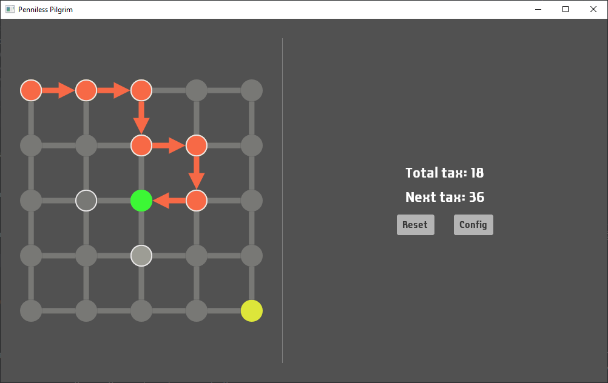

# Penniless Pilgrim

## Goals
- To learn Haskell and [Monomer](https://github.com/fjvallarino/monomer) library.
- To have simple interface to try and solve [penniless pilgrim riddle](https://ed.ted.com/lessons/can-you-solve-the-penniless-pilgrim-riddle-daniel-finkel).

## Features
- Pilgrim can be moved with arrows, WASD or mouse.
- Next tax shows when hovering over next node (if pilgrim can go there).
- Grid can be resized to have different dimensions other than 5x5.
- Interface can be customized via [config.json](assets/config.json).

## License
- This project is licensed under the [MIT license](LICENSE.md).
- This project uses [Laconic](https://www.fontsquirrel.com/fonts/laconic) font, licensed under the [SIL Open Font License](https://www.fontsquirrel.com/license/laconic).